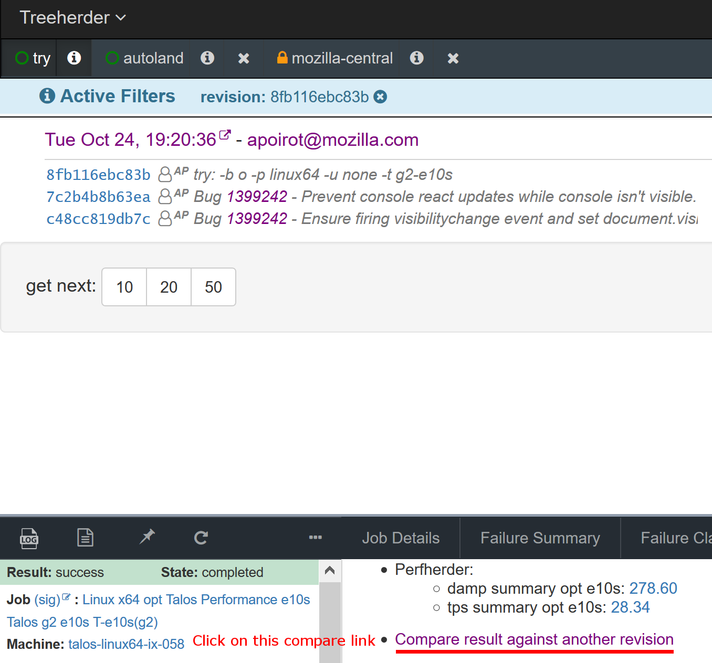
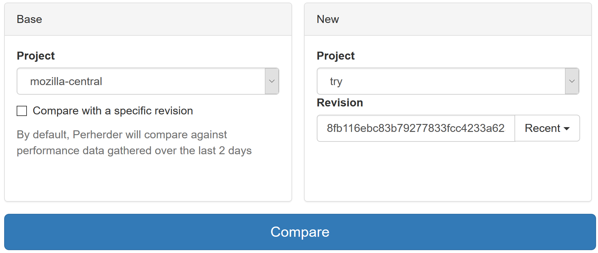
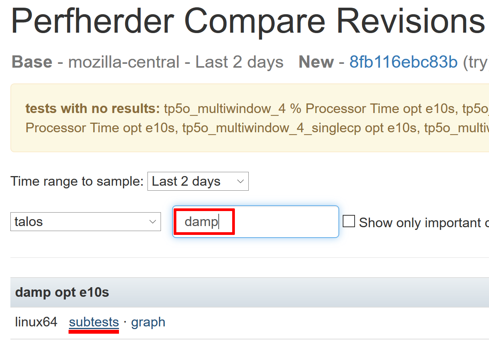
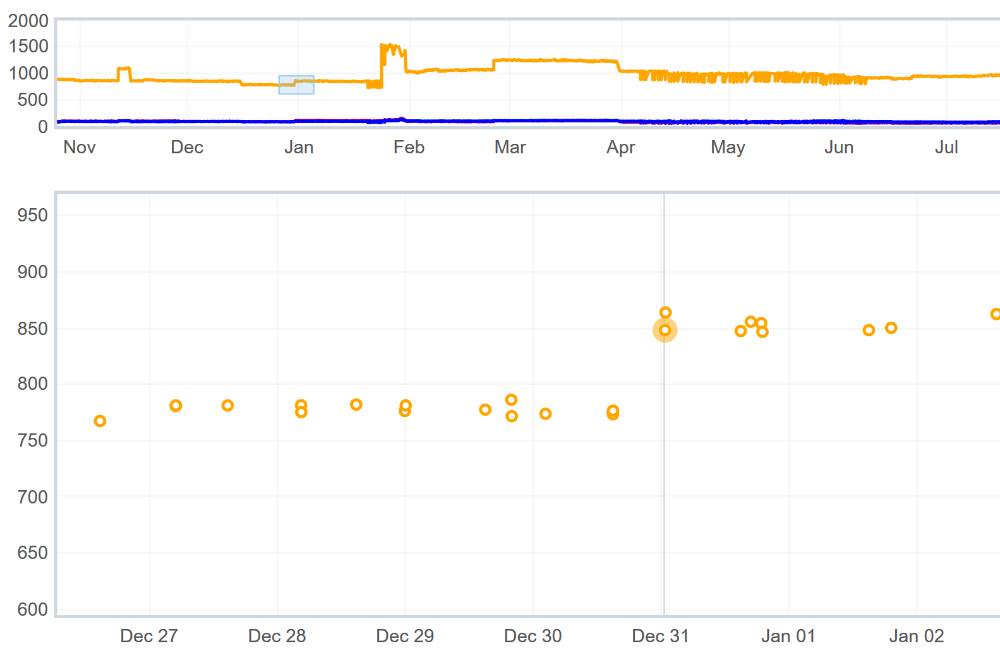
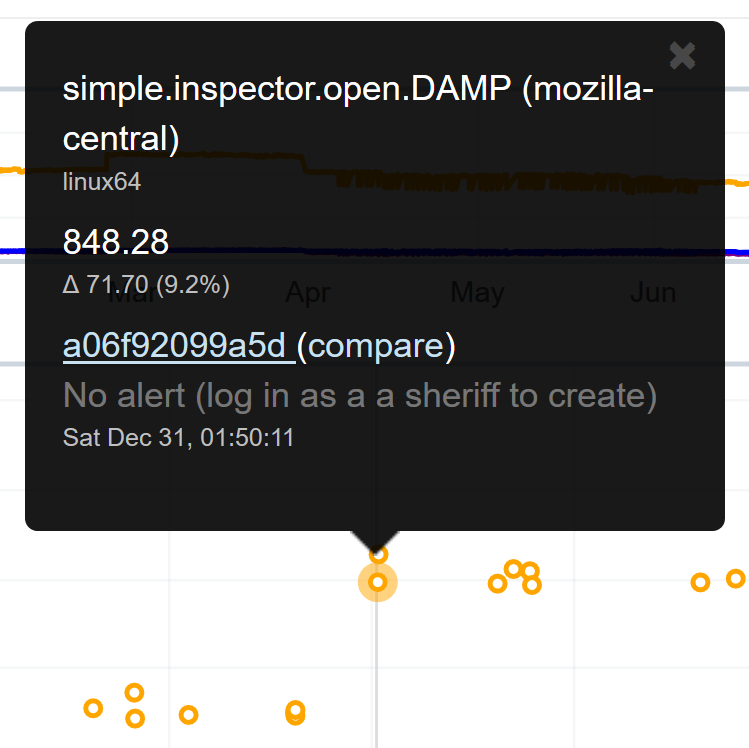

# Performance Tests: DAMP

DAMP (DevTools At Maximum Performance) is our test suite to track performance.

## How to run it locally?

```bash
./mach talos-test --activeTests damp
```
Note that the first run is slower as it pulls a large tarball with various website copies.
This will run all DAMP tests, you can filter by test name with:
```bash
./mach talos-test --activeTests damp --subtests console
```
This command will run all tests which contains "console" in their name.

### Command line options

#### Running tests only once

```bash
./mach talos-test --activeTests damp --cycles 1 --tppagecycles 1
```
`--cycles` will limit the number of Firefox restart to only one, while
`--tppagecycles` will limit the number of test re-run in each firefox start to one.
This is often helpful when debugging one particular subtest.

#### Taking screenshots

```bash
DEBUG_DEVTOOLS_SCREENSHOTS=1 ./mach talos-test --activeTests damp
```
When passing `DEBUG_DEVTOOLS_SCREENSHOTS` env variable, screenshots will be taken after each subtest
was run. The screenshot will be opened in new tabs and their title
includes the subtest label. Firefox won't automatically close so that you can view the screenshots.

#### Recording a profile

```bash
./mach talos-test --activeTests damp --geckoProfile --geckoProfileEntries 100000000
```
This will automatically record the tests and open the profile. You may use the following command in order
to focus on just one subtest run:
```bash
./mach talos-test --activeTests damp --subtests custom.webconsole --cycles 1 --tppagecycles 1 --geckoProfile --geckoProfileEntries 100000000
```

## How to run it on try?

```bash
./mach try -b o -p linux64 -u none -t damp --rebuild-talos 6
```
* Linux appears to build and run quickly, and offers quite stable results over the other OSes.
The vast majority of performance issues for DevTools are OS agnostic, so it doesn't really matter which one you run them on.
* "damp" is the talos bucket in which we run DAMP.
* And 6 is the number of times we run DAMP tests. That's to do averages between all the 6 runs and helps filtering out the noise.

## What does it do?

DAMP measures three important operations:
* Open a toolbox
* Reload the web page
* Close the toolbox
It measures the time it takes to do each of these operations for the following panels:

inspector, console, netmonitor debugger, memory, performance.

It runs all these three tests two times. Each time against a different web page:
* "simple": an empty webpage. This test highlights the performance of all tools against the simplest possible page.
* "complicated": a copy of bild.de website. This is supposed to represent a typical website to debug via DevTools.

Then, there are a couple of extra tests:
* "cold": we run the three operations (open toolbox, page reload and close toolbox) first with the inspector.
This is run first after Firefox's startup, before any other test.
This test allows to measure a "cold startup". When a user first interacts with DevTools, many resources are loaded and cached,
so that all next interactions will be significantly faster.
* and many other smaller tests, focused on one particular feature or possible slowness for each panel.

## How to see the results from try?

First, open TreeHerder. A link is displayed in your console when executing `./mach try`.
You should also receive a mail with a link to it.

Look for "T-e10s(+6)", click on "+6", then click on "damp":


On the bottom panel that just opened, click on "Compare result against another revision".


You are now on PerfHerder, click on "Compare",


Next to "Talos" select menu, in the filter textbox, type "damp".
Under "damp opt e10s" item, mouse over the "linux64" line, click on "subtests" link.


And here you get the results for each DAMP test:


On this page, you can filter by test name with the filter box on top of the result table.
This table has the following columns:
* Base:
  Average time it took to run the test on the base build (by default, the last 2 days of DAMP runs on mozilla-central revisions)
* New:
  Average time it took to run the test on the new build, the one with your patches.
  Both "Base" and "New" have a  "± x.xx%" suffix which tells you the variance of the timings.
  i.e. the average difference in percent between the median timing and both the slowest and the fastest.
* Delta:
  Difference in percent between the base and new runs.
  The color of this can be red, orange or green:
   * Red means "certainly regressing"
   * Orange means "possibly regressing"
   * Green means "certainly improving"
   * No colored background means "nothing to conclude"
  The difference between certainly and possibly is explained by the next column.
* Confidence:
  If there is a significant difference between the two runs, tells if the results is trustworthy.
   * "low" either means there isn't a significant difference between the two runs, or the difference is smaller than the typical variance of the given test.
   If the test is known to have an execution time varying by 2% between two runs of the same build, and you get a 1% difference between your base and new builds,
   the confidence will be low. You really can't make any conclusion.
   * "med" means medium confidence and the delta is around the size of the variance. It may highlight a regression, but it can still be justified by the test noise.
   * "high" means that this is a high confidence difference. The delta is significantly higher than the typical test variance. A regression is most likely detected.

There is also "Show only important changes" checkbox, which helps seeing if there is any significant regression.
It will only display regressions and improvements with a medium or high confidence.

## How to contribute to DAMP?

DAMP is based on top of a more generic test suite called [Talos](https://wiki.mozilla.org/Buildbot/Talos).
Talos is a Mozilla test suite to follow all Firefox components performance.
It is written in Python and here are [the sources](https://dxr.mozilla.org/mozilla-central/source/testing/talos/) in mozilla-central.
Compared to the other test suites, it isn't run on the cloud, but on dedicated hardware.
This is to ensure performance numbers are stable over time and between two runs.
Talos runs various types of tests. More specifically, DAMP is a [Page loader test](https://wiki.mozilla.org/Buildbot/Talos/Tests#Page_Load_Tests).
The [source code](http://searchfox.org/mozilla-central/source/testing/talos/talos/tests/devtools/) for DAMP is also in mozilla-central.
The [main script](http://searchfox.org/mozilla-central/source/testing/talos/talos/tests/devtools/addon/content/damp.js) contains the implementation of all the tests described in "What does it do?" paragraph.

## How to see the performance trends?

You can find the dedicated performance dashboard for DevTools at http://firefox-dev.tools/performance-dashboard. You will find links to trend charts for various tools:
* [Inspector dashboard](http://firefox-dev.tools/performance-dashboard/tools/inspector.html?days=60&filterstddev=true)
* [Console dashboard](http://firefox-dev.tools/performance-dashboard/tools/console.html?days=60&filterstddev=true)
* [Netmonitor dashboard](http://firefox-dev.tools/performance-dashboard/tools/netmonitor.html?days=60&filterstddev=true)
* [Debugger dashboard](http://firefox-dev.tools/performance-dashboard/tools/debugger.html?days=60&filterstddev=true)

Each tool page displays charts for all the subtests relevant for a given panel.

Each circle on the chart is a push to mozilla-central. You can hover on a circle to see some additional information about the push, such as the date, the performance impact for the subtest, and the push id. Clicking on a circle will take you to the pushlog.

Colored circles indicate that the push contains a change that was identified as having a performance impact. Those can be categorized as:
- hardware: hardware change for the machines used to run Talos
- platform: non-DevTools change that impacts DevTools performance
- damp: test change in DAMP that impacts test results
- devtools: identified DevTools change that introduced an improvement or regression

This data is synchronized from a [shared Google doc](https://docs.google.com/spreadsheets/d/12Goo3vq-0X0_Ay-J6gfV56pUB8GC0Nl62I4p8G-UsEA/edit#gid=0).

There is a PerfHerder link on each chart that will take you to the PerfHerder page corresponding to this subtest.

## How to use PerfHerder charts

On PerfHerder charts, each circle is a push on mozilla-central.
When you see a spike or a drop, you can try to identify the patch that relates to it by clicking the circles.
It will show a black popup. Then click on the changeset hash like "cb717386aec8" and you will get a mercurial changelog.
Then it is up to you to read the changelog and see which changeset may have hit the performance.

For example, open [this page](https://treeherder.mozilla.org/perf.html#/graphs?timerange=31536000&series=mozilla-central,1417969,1,1&series=mozilla-central,1417971,1,1&series=mozilla-central,1417966,1,1&highlightedRevisions=a06f92099a5d&zoom=1482734645161.3916,1483610598216.4773,594.756508587898,969.2883437938906).
This is tracking inspector opening performance against the "Simple" page.


See the regression on Dec 31th?
Now, click on the first yellow circle of this spike.
You will get a black popup like this one:


Click on the [changelog link](https://hg.mozilla.org/mozilla-central/pushloghtml?fromchange=9104708cc3ac0ccfe4cf5d518e13736773c565d7&tochange=a06f92099a5d8edeb05e5971967fe8d6cd4c593c) to see which changesets were added during this run. Here, you will see that the regression comes from these patches:
 * Bug 1245921 - Turn toolbox toolbar into a React component
 * Bug 1245921 - Monkey patch ReactDOM event system for XUL
